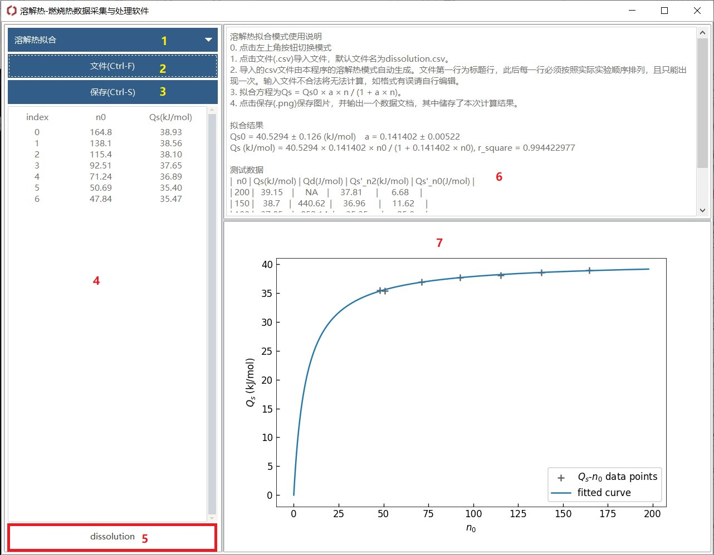

<!-- omit in toc -->
# 热力学实验采集程序使用说明

<!-- omit in toc -->
# 目录

- [0. 程序介绍](#0-程序介绍)
- [1. 数据记录](#1-数据记录)
- [2. 溶解热单轮数据处理（单次的溶解热效应）](#2-溶解热单轮数据处理单次的溶解热效应)
- [3. 燃烧热数据处理](#3-燃烧热数据处理)
- [4. 溶解热拟合数据处理（微分溶解热等）](#4-溶解热拟合数据处理微分溶解热等)

# 0. 程序介绍

这是介绍这个程序如何在实验中使用的一篇文档。本程序具有四个模块的功能：

- 数据采集
- 溶解热数据处理
- 燃烧热数据处理
- 积分溶解热拟合

以下将会介绍相应功能的界面、操作步骤，读取的文件格式以及其他信息。

# 1. 数据记录

以下是数据记录的界面，用于记录实验的原始数据，获取各个时间点的温度。各部分功能如下

1. 选择程序模式，当前是数据记录模式
2. 选择串口。当第一次启动时需要刷新串口以获取所有可用串口。
3. 刷新串口
4. 选择记录模式
5. 记录开始记录、结束记录、开始加热、结束加热时间和数据保存
6. 数据显示，包括时间和温差
7. 其他数据记录
8. 使用说明及信息展示，显示部分主要操作的时间
9. 温差随时间变化图像（仅最近500个数据点）

**操作步骤**

1. 使用USB线将仪器背后的USB口与电脑相连，打开程序（数据线由实验室提供）
2. 点击左上角下拉按钮选择程序模式，选择“数据记录”。
3. 点击“刷新串口”按钮，程序会自动筛选可以使用的串口。如果发现左侧表格中不断有数据加入，同时右下角图表不断更新，则说明已正常连接。如果检查发现读取数据与仪器数据不一致，可以尝试在选择串口的下拉框中选择对应串口。
4. 根据实验选择记录模式。
5. 点击“开始记录”按钮开始正式记录，点击“结束记录”按钮完成一轮实验数据的记录。若为溶解热记录模式，则在开启和关闭加热器（恒流电源）时，需要同时手动点击“开始加热”与“结束加热”按钮以记录加热时间。
6. 在右上角记录如室温、溶质质量、燃烧物质量等其他数据。
7. 点击“保存数据”按钮选择文件位置保存数据。

**其他事项说明**

1. 在程序所在文件夹下，数据记录时会出现一个名为`tempfile.tmp`的文件，可使用记事本打开（鼠标右键-打开方式-记事本）。该文件中保存有自最近一次开始记录以来的各个时间对应的温度，结束记录的时间，以及溶解热中开始加热和结束加热的时间。当发生意外时这些数据可以作为原始数据进行手动处理作为补救。
2. 保存文件时建议使用纯英文命名以防中文编码不同导致乱码的情况发生。保存得到的csv文件可以用记事本、Excel、Origin等软件打开。具体csv文件格式见其他章节。
3. 我们为大部分按钮绑定了快捷键，相应快捷键位于括号中（如"刷新串口(Ctrl+Shift+R)"，在macOS中，Alt用cmd代替），可以使用键盘较方便地操作。例如，如果需要打开电源而后迅速点击“开始加热”按钮，使用快捷键可以减少没点到的可能。其他界面也有相应快捷键，后续不再赘述。
4. 本程序在参数输入上进行了优化，可以进行简单的数学运算。比如，当你想输入25℃的温度时，你可以直接输入`25+273.15`，而不需要算出`298.15`再输入。其他模块的参数输入框也有类似功能，后续不再赘述。

# 2. 溶解热单轮数据处理（单次的溶解热效应）

以下是溶解热单轮的数据处理的界面，用于对原始数据进行雷诺校正后根据电热补偿法的热量计算出溶液的实际吸热。各部分功能如下

1. 选择程序模式，当前是溶解热模式。
2. 打开溶解热数据文件按钮。推荐使用本程序在“数据记录”模式下的文件。
3. 保存计算结果按钮。（包括绘图和单次溶解热数值）
4. 溶解热数据表格，三列从左到右分别为第几个点（从0开始）、自开始记录以来过去的时间、在该时间点的温度。
5. 信息显示，打开文件后显示文件名。
6. 三处雷诺校正所需线性拟合的起终点设置。
7. 重置按钮，重置雷诺校正所需线性拟合的起终点为程序推荐的点
8. 计算按钮，用于进行雷诺校正、积分、计算单次溶解热效应。
9. 相关参数及溶解热结果
10. 使用说明及信息展示，打开文件后显示线性拟合结果，点击计算后显示积分结果
11. 温差随时间变化图片

**操作步骤**

1. 打开程序，点击左上角下拉按钮选择程序模式，选择“溶解热”。
2. 点击“文件(Ctrl+F)”按钮，选择文件。推荐使用本程序记录的文件，也可参考后续文件格式介绍根据数据整理一个符合格式的文件。
3. 导入文件后，程序会根据数据自动计算出推荐的三次线性拟合的起终点。如果对程序给出的推荐起终点不满意，可以在起终点设置区内选择待调整的起终点，按↑↓或直接输入进行调整。若调整后还想回到最初的设置，可以点击重置按钮。需要注意，本程序不允许线性拟合的部分出现重叠，即上一组线性拟合的终点要小于下一组线性拟合的起点。
4. 检查右侧的各项参数数值，如溶质摩尔质量等，如果有误可以修改。注意，如果要同时修改温度与水密度或水热容参数的话，建议先修改温度再修改后者，因为后者会随温度自动更新。
5. 检查无误后点击计算，程序会计算出相应的热效应，显示在参数区的相应位置。若对积分结果或拟合结果不满意，可以继续调整线性拟合起终点，并点击计算按钮。
6. 检查无误后点击"保存(Ctrl+S)"按钮，会将图片以及计算结果保存至数据文件的同一目录下，分别为与数据文件同名的png图片文件与`dissolution.csv`文件。
7. 如果还有数据文件需要处理可重复上述操作，计算结果会附加在`dissolution.csv`文件后。**处理时，建议按照时间顺序从早到晚处理，以使`dissolution.csv`文件可被本程序“溶解热拟合”模块正确识别。**

**文件格式**

本模块建议使用本程序记录得到的数据文件，但你也可以根据如下格式重新组织你的数据使之能被本模块识别。

- 文件需采用UTF8编码
- 每行可填两个数据，用英文逗号隔开
- 前九行需写所需参数，每一行第一个数据为参数名，第二个数据为参数值，参数名及其含义如下
  + `room_temperature(K)` 温度，单位为(K)
  + `water_volume(mL)` 溶液体积，单位为(mL)
  + `solute_molarmass(g/mol)` 溶质的摩尔质量，单位为(g/mol)
  + `solute_mass(g)` 溶质的质量，单位为(g)
  + `R1(Omega)` 实验前电阻，单位为(Ω)
  + `R2(Omega)` 实验后电阻，单位为(Ω)
  + `t1(s)` 开始加热的时间点，单位为(s)
  + `t2(s)` 结束加热的时间点，单位为(s)
  + `current(A)` 电流大小，单位为(A)
- 后续行需写温度曲线相关数据
  + 第十行写表头`time(s),Delta_T(K)`
  + 后续行每行第一个数据为时间点，单位为(s)，第二个数据为温度相较于最初设定温度的变化，单位为(K)

**其他事项说明**

1. 本程序内置了CRC Handbook of Chemistry and Physics 95th Edition中水的密度和热容常数，根据输入温度自动更新取值。如果对该值不满意也可以修改。
2. 如导入文件后没有响应，检查文件的编码格式是否为UTF-8，检查文件内有无特殊字符。

# 3. 燃烧热数据处理

以下是溶解热单轮的数据处理的界面，用于对原始数据进行雷诺校正后计算出燃烧热。各部分功能如下

1. 选择程序模式，当前是燃烧热模式。
2. 打开燃烧热数据文件按钮。推荐使用本程序在“数据记录”模式下的文件。
3. 保存计算结果按钮。（包括量热计常数和燃烧热）
4. 燃烧热数据表格，三列从左到右分别为第几个点（从0开始）、自开始记录以来过去的时间、在该时间点的温度。
5. 信息显示，打开文件后显示文件名。
6. 两处处雷诺校正所需线性拟合的起终点设置。
7. 重置按钮，重置雷诺校正所需线性拟合的起终点为程序推荐的点
8. 计算按钮，用于进行雷诺校正、积分、计算单次溶解热效应。
9. 选择计算模式，可选计算量热计常数与计算燃烧热
10. 相关参数及结果区
11. 使用说明及信息展示，打开文件后显示线性拟合结果，点击计算后显示积分结果
12. 温差随时间变化图片

**操作步骤**

1. 打开程序，点击左上角下拉按钮选择程序模式，选择“燃烧热”。
2. 点击“文件(Ctrl+F)”按钮，选择文件。推荐使用本程序记录的文件，也可参考后续文件格式介绍根据数据整理一个符合格式的文件。
3. 导入文件后，程序会根据数据自动计算出推荐的三次线性拟合的起终点。如果对程序给出的推荐起终点不满意，可以在起终点设置区内选择待调整的起终点，按↑↓或直接输入进行调整。若调整后还想回到最初的设置，可以点击重置按钮。需要注意，本程序不允许线性拟合的部分出现重叠，即上一组线性拟合的终点要小于下一组线性拟合的起点。
4. 选择计算模式为常数模式或是样品模式，前者计算量热计常数，后者计算样品燃烧热。
5. 检查右侧的各项参数数值，如苯甲酸燃烧热等，如果有误可以修改。注意，如果要同时修改温度与水密度或水热容参数的话，建议先修改温度再修改后者，因为后者会随温度自动更新。
6. 检查无误后点击计算，程序会计算出相应结果，显示在参数区的相应位置。若对积分结果或拟合结果不满意，可以继续调整线性拟合起终点，并点击计算按钮。
7. 检查无误后点击"保存(Ctrl+S)"按钮，会将图片以及计算结果保存至数据文件的同一目录下，分别为与数据文件同名的png图片文件与`combustion.csv`文件。
8. 如果还有数据文件需要处理可重复上述操作，计算结果会附加在`combustion.csv`文件后。**注意若要先计算量热计常数后计算样品燃烧热时，建议在计算完量热计常数导入样品燃烧热实验数据前先将模式切换到样品模式，否则量热计常数会被清空。**

**文件格式**

本模块建议使用本程序记录得到的数据文件，但你也可以根据如下格式重新组织你的数据使之能被本模块识别。

- 文件需采用UTF8编码
- 每行可填两个数据，用英文逗号隔开
- 前六行需写所需参数，每一行第一个数据为参数名，第二个数据为参数值，参数名及其含义如下
  + `room_temperature(K)` 温度，单位为(K)
  + `water_volume(mL)` 溶液体积，单位为(mL)
  + `cotton_mass(g)` 棉线等其他物质的质量，单位为(g)
  + `combustible_mass(g)` 溶质的质量，单位为(g)
  + `Nickel_before_mass(g)` 实验前镍丝质量，单位为(g)
  + `Nickel_after_mass(g)` 实验后镍丝质量，单位为(g)
- 后续行需写温度曲线相关数据
  + 第七行写表头`time(s),(Delta_T(K))`
  + 后续行每行第一个数据为时间点，单位为(s)，第二个数据为温度相较于最初设定温度的变化，单位为(K)

**其他事项说明**

1. 本程序内置了CRC Handbook of Chemistry and Physics 95th Edition中水的密度和热容常数，根据输入温度自动更新取值。如果对该值不满意也可以修改。
2. 如导入文件后没有响应，检查文件的编码格式是否为UTF-8，检查文件内有无特殊字符。

# 4. 溶解热拟合数据处理（微分溶解热等）

以下是溶解热拟合的数据处理的界面，用于溶解热曲线拟合，以及积分溶解热。各部分功能如下，

1. 选择程序模式，当前是溶解热拟合模式。
2. 打开溶解热拟合数据文件按钮。推荐使用本程序在“溶解热”模式下的文件`dissolution.csv`。
3. 保存计算结果按钮。
4. 溶解热拟合数据表格，三列从左到右分别为第几轮实验（从0开始）、溶剂溶质物质的量比、在该比下的积分溶解热。
5. 信息显示，打开文件后显示文件名。
6. 使用说明及信息展示，显示结果
7. 积分溶解热经验公式拟合曲线图

**操作步骤**

1. 打开程序，点击左上角下拉按钮选择程序模式，选择“溶解热拟合”。
2. 点击“文件(Ctrl+F)”按钮，选择文件。推荐使用本程序记录的文件，也可参考后续文件格式介绍根据数据整理一个符合格式的文件。
3. 导入文件后，程序会自动计算出相应的积分/微分溶解热/冲淡热，并绘图。检查无误后点击"保存(Ctrl+S)"按钮，会将图片以及计算结果保存至数据文件的同一目录下，分别为与数据文件同名的png图片文件和计算结果`dissolution_fitted_data.csv`。

**文件格式**

本模块建议使用本程序记录得到的数据文件，但你也可以根据如下格式重新组织你的数据使之能被本模块识别。

- 文件需采用UTF8编码
- 每一行可有任意列，列间由英文逗号分隔，各行列数相同。第一行为表头，需要保证如下列必须存在
  + `water_volume(mL)` 溶液体积，单位为(mL)
  + `water_density(g/mL)` 溶液密度，单位为(g/mL)
  + `solute_molarmass(g/mol)` 溶质的摩尔质量，单位为(g/mol)
  + `solute_mass(g)` 溶质的质量（**不是累积的溶质质量**），单位为(g)
  + `dissolution_heat(kJ)` 单轮实验的溶解热效应（**不是累积热效应**），单位(kJ)
- **各行必须按时间顺序从早到晚排序**

**其他事项说明**

1. 如导入文件后没有响应，检查文件的编码格式是否为UTF-8，检查文件内有无特殊字符。